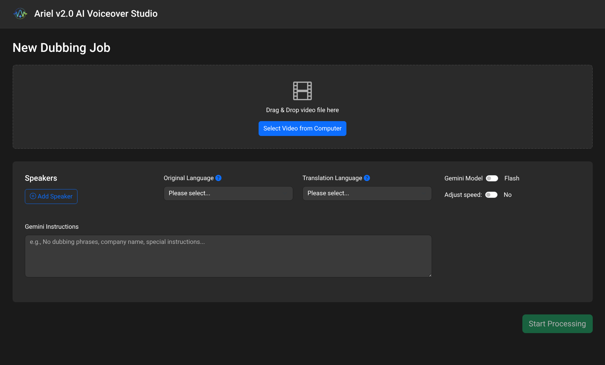
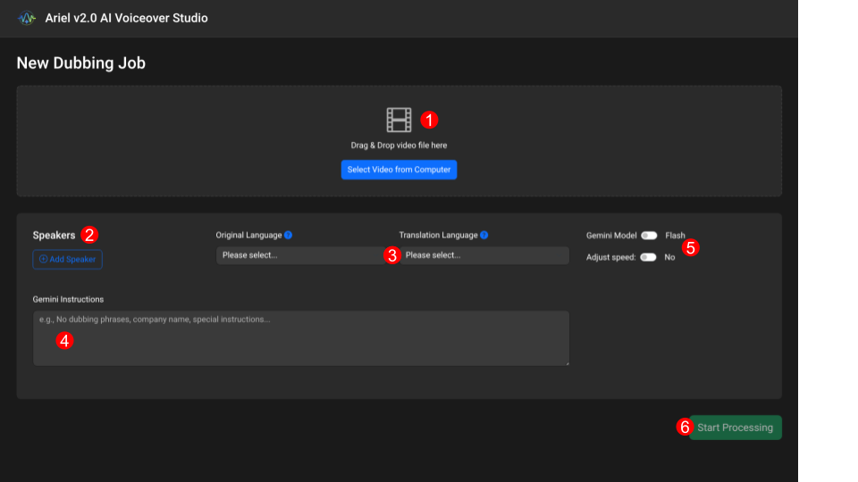
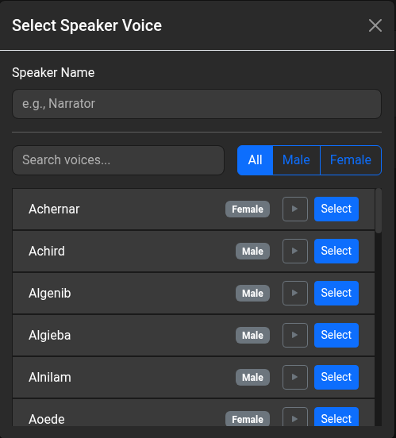
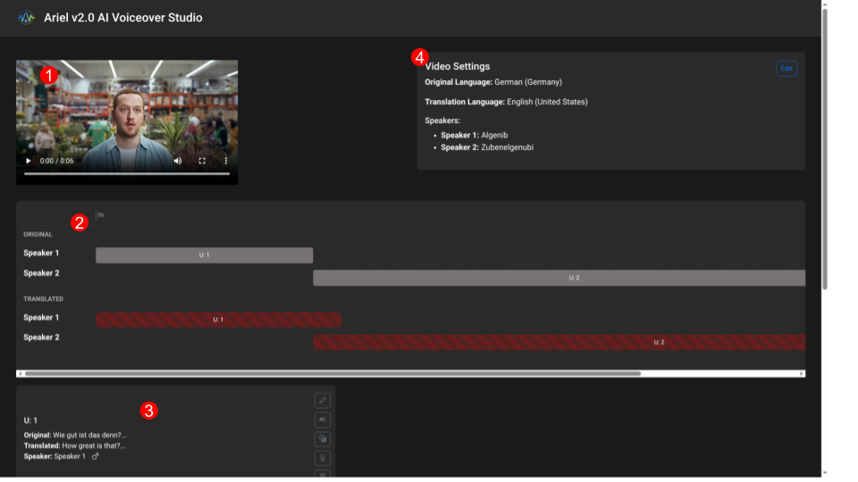
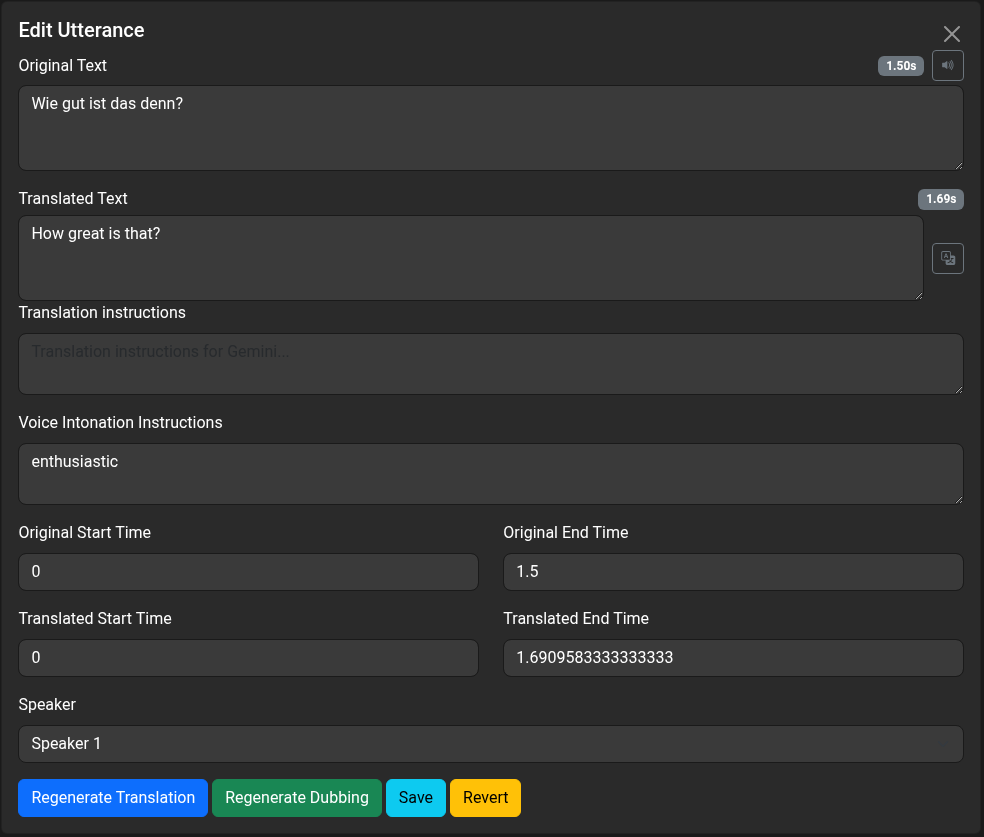
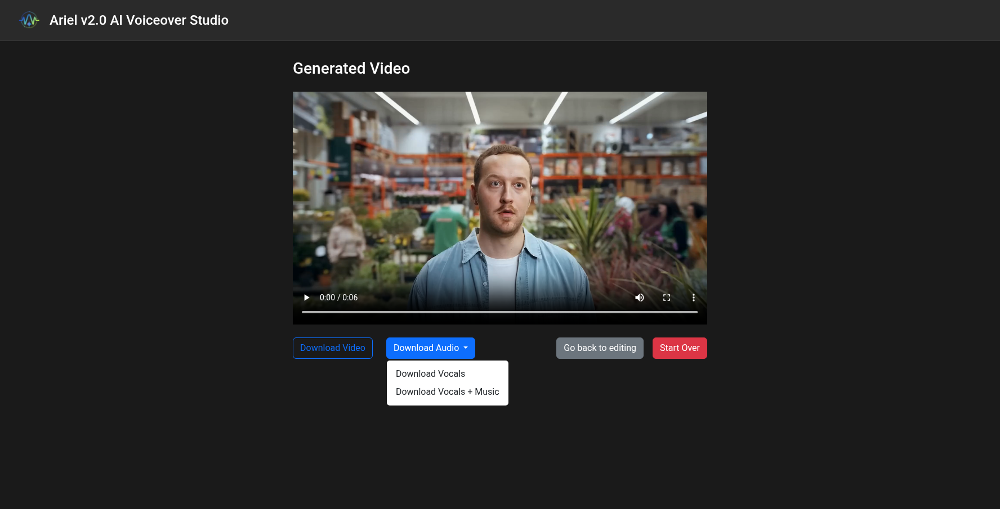

<!--
 Copyright 2025 Google LLC

 Licensed under the Apache License, Version 2.0 (the "License"); you may not
 use this file except in compliance with the License. You may obtain a copy
 of the License at

   http://www.apache.org/licenses/LICENSE-2.0

 Unless required by applicable law or agreed to in writing, software
 distributed under the License is distributed on an "AS IS" BASIS, WITHOUT
 WARRANTIES OR CONDITIONS OF ANY KIND, either express or implied. See the
 License for the specific language governing permissions and limitations
 under the License.
-->

#  Ariel v2 User Manual

--------------------------------------------------------------------------------

# Introduction

Ariel v2.0 is an AI-powered video dubbing tool designed to translate video voice
tracks seamlessly. It utilizes Google's Gemini models to transcribe, translate,
and re-dub videos into different languages while preserving background music and
sound effects. The tool provides a web-based interface for uploading videos,
managing speakers, editing translations, and fine-tuning audio timing.

## Note on Data Residency

## Ariel uses Google Gemini Text-To-Speech (TTS). This model is only available using the global Cloud Region. To simplify deployment, as certain versions of Gemini models are not available in every region, we also use the global region when sending data to Gemini. If you have strict policies requiring you to process data in specific regions, please be aware that the solution will require bespoke changes to meet your requirements and cannot be used as is.

# Getting Started

To access Ariel v2.0, navigate to the URL provided by your deployment
administrator. The application runs in a web browser and does not require local
installation for the end-user.

## The Interface

Upon loading the application, you will be presented with the **New Dubbing Job**
screen. This is where you configure the initial processing parameters.

--------------------------------------------------------------------------------

# 2\. Setting Up a Dubbing Job

## Step 1: Upload Video

1.  Drag and drop your video file (e.g., MP4) into the designated **Video Drop
    Zone** area.

2.  Alternatively, click the **Select Video from Computer** button to browse
    your files.

3.  Once selected, a preview of the video will appear in the player.

## Step 2: Configure Speakers

You must identify the speakers in the video *before* processing to ensure
specific voices are assigned to them. Follow the instructions for each speaker
in the order they speak in the video:

1.  Click the **⊕ Add Speaker** button in the "Speakers" section.

2.  A modal window labeled **Select Speaker Voice** will appear.

3.  **Speaker Name (optional):** Enter a label for the speaker (e.g.,
    "Narrator", "Interviewer").

4.  **Select Voice:**

    *   Use the search bar to find specific voices (e.g., "Zephyr", "Charon").

    *   Filter by Gender using the **Male** / **Female** / **All** buttons.

    *   Click the **Play icon ()** next to a
        voice to preview it.

5.  Select your desired voice and by clicking **Select**..

6.  Repeat this process for every distinct speaker in your video.

## Step 3: Language Settings

1.  **Original Language:** Select the language currently spoken in the video
    from the dropdown menu.

2.  **Translation Language:** Select the target language you wish to dub the
    video into.

## Step 4: Gemini Instructions

In the text box provided, you can enter specific prompts for the AI to use
during translation. Use this to specify words that should remain in the original
language (like brand names) or to set a specific tone (e.g. formal or youthful).

The solution will attempt to match the spoken tone of voice automatically, so no
instructions for generating the dubbed audio are available here. To change the
dubbed audio, follow the instructions below in section **4\. Editing
Utterances**.

## Step 5: Advanced Configuration

*   **Gemini Model Toggle:** Switch between **Flash** (faster, lower cost) and
    **Pro** (higher quality, higher cost) models for the translation and logic
    processing.

*   **Adjust Speed:** Toggle **Yes** to force the translated audio to speed up
    or slow down to match the exact duration of the original speech. *Note: This
    may result in unnatural audio artifacts*.

## Step 6: Start Processing

Click the green **Start Processing** button. The application will separate the
audio tracks, transcribe the text, translate it, and generate the initial
dubbing.

**Note:** A "Thinking" animation will appear while the backend processes the
video. This may take a few minutes depending on the video length.

--------------------------------------------------------------------------------

# 3\. The Editing Studio

Once processing is complete, the view shifts to the Editing Studio. Here you can
refine the translation, timing, and audio.

## 1 Video Player

A floating video player allows you to preview the results. You can drag this
player around the screen to uncover other controls.

## 2 The Timeline

The timeline visualizes the synchronization between the original audio and the
new dubbing.

*   **Original:** Shows the timing of the original speech. Each speaker is given
    a swimlane, with their utterances depicted as bars with lengths showing the
    duration of the utterance. The utterance ID (e.g. U1) is shown on the bar.

*   **Translated:** Shows the generated audio blocks. As with the original, each
    speaker is given a swimlane for their utterances.

In the timeline, utterances have three colors:

*   **Blue:** the utterance does not overlap with another utterance.

*   **Red-stripped**: the current utterance overlaps with another. Generally,
    this means the translated utterance is longer than the original.

*   **Yellow:** no audio was generated for this utterance. These will also be
    yellow in the utterance list. The lack of audio can be due to a safety
    filter being triggered when requesting the audio from TTS, or some other
    error. Try updating the translated text and regenerating the dubbing to
    create usable audio.

You can **drag a translated utterance** to adjust its start time. Click and drag
a translated utterance block left or right to change its start time manually.
The duration of the utterance does not change when dragging.

## 3 Utterance List

Located on the bottom left, there is a list of utterances, i.e. segments of
speech from the video . Each utterance shows the text from the original video,
the translation of the text, and the speaker who made the utterance. In
addition, there are five icons placed along the right:

 Used to open this utterance in the
editor.

 Play the original audio from the
video.

 Play the translated audio.

 Use the original audio in the final
video.

 Don’t use audio for this utterance in
the final video.

## 4 General Video Settings

The initial settings used for the dubbing are shown at the top right of the
page. If you need to change the target language or a speaker's voice for the
*entire* video:

1.  Click the **Edit** button in the **Video Settings** card (top right).

2.  Change the **Translation Language** to re-translate the entire script.

3.  Click on a Speaker's name to swap their assigned voice for all their lines.

4.  Click **Submit** to process these changes or **Cancel** to continue with the
    current dubbing.

After clicking **Submit**, the video will be reprocessed, with updated
transcription, translation, and dubbing.

--------------------------------------------------------------------------------

# 4\. Editing Utterances

Clicking the **Pencil Icon** on an utterance opens the **Utterance Editor** on
the right side of the screen.

## Available Actions:

1.  **Edit the original transcription:** You can manually type corrections into
    the **Original Text** text box. This may be necessary for misunderstood
    slang or if you’d like to use a different specific text for the translation.
    After editing the original text, you should regenerate the translation,
    using the **Regenerate Translation** button at the bottom of the editor.

2.  **Edit the translation:** You can manually change the translation as well,
    by typing in the **Translated Text** box. You may want to do this to use
    more appropriate words for the context, or to change the length of the text
    to better match the original. After updating the translation, you should
    regenerate the dubbing, using the **Regenerate Dubbing** button at the
    bottom of the editor.

3.  **Refine Translation:** You can enter instructions in the "Translation
    instructions" box (e.g., "Make this sound more formal")to have Gemini update
    the translation. Once you’ve added the instructions, click **Regenerate
    Translation** to automatically update the translated text.

4.  **Refine Intonation:** You can change the tone and speed of the generated
    audio by entering instructions in the "Voice Intonation Instructions" box
    (e.g., "Speak excitedly", or “relaxed but quick”). After entering
    instructions, click **Regenerate Dubbing** to automatically generate new
    audio. A green toast will appear when the generation is complete.

5.  **Adjust Timing:** Manually type new values into the **Translated Start
    Time** or **Translated End Time** boxes to shift the utterance forwards or
    back in the final video. Changing one will automatically update the other to
    maintain the duration of the utterance. To change the duration, regenerate
    the dubbing using the “Voice Intonation Instructions”, as per 4\.

6.  **Change Speaker:** Use the dropdown to assign a different speaker voice to
    this specific utterance.

In addition, you can hear the original audio by clicking the ![][image8]button,
and listen to the translated audio by clicking the ![][image9] button. Please
note \- Cloud Run may need some time to start up. If you click the button and
nothing happens, please be patient and wait for the audio. Clicking multiple
times will result in the audio being played multiple times, possibly at the same
time.

To save the changes, click **Save**. To revert to the last saved version, click
**Revert**.

**Important:** You must click **Save** to apply your changes to the timeline.

## Dealing with zero-length utterances

When the text of an utterance triggers the TTS safety filters, or another error
occurs during audio generation, an utterance with a duration of zero is
produced. The **Generate Video** button is disabled until all zero-length
(highlighted in yellow) utterances are dealt with.

The most common way to fix a zero-length utterance is by regenerating the
dubbing. In some cases, this will work without any additional changes to the
utterance. More often, some words in the translation, such as tradewords or
profanity, trigger TTS’s safety filter and need to be changed before audio can
be generated. Follow the instructions in **2\. Edit the Translation** and/or
**3\. Refine Translation** from above to generate audio for the affected
utterance.

Another option for zero-length utterance is to use the original audio in the
final video. This may be appropriate for tradewords or other important aspects
of the video that need to be included in the final output. To use the original
audio, click the struck-through microphone icon (![][image10]) in the utterance
list.

## The final option for zero-length utterance is to use no audio at all for the utterance. For cases where the audio isn’t relevant to the new target market, or other aspects of the video can portray the required context, this may be an appropriate option. To leave the audio out, click the trash can icon (![][image11]) in the utterance list.

# 5\. Finalizing and Downloading

Once you are satisfied with the edits click the blue **Generate Video** button
at the bottom of the screen. The system will mix the background music, sound
effects, and new voice tracks into a final video file.

When processing finishes, the **Generated Video View** will appear. In this
view, you have the following options:

1.  **Preview:** Watch the final result in the player.

2.  **Download:**

    *   **Download Video:** Saves the final MP4 file.

    *   **Download Audio \-\> Vocals:** Saves a WAV file containing only the
        spoken AI voices.

    *   **Download Audio \-\> Vocals \+ Music:** Saves a WAV file containing the
        AI voices mixed with the background music.

--------------------------------------------------------------------------------

# Troubleshooting & Constraints

*   **Zero Duration Error:** If an utterance has a duration of 0s, you cannot
    generate the final video. Ensure all segments have valid start and end
    times.

*   **Overlapping Audio:** If you drag a timeline block on top of another, an
    overlap warning will appear. Adjust the timing to ensure clear audio.

*   **Cost Management:** Be aware that processing long videos consumes more
    tokens. A 10-second video uses approx. 1000-1500 tokens for transcription
    and 600-1000 for translation. At the time of writing (December 2025), this
    is less than 0.10 USD.

*   **Background sound sometimes too loud:** Ariel does not currently support
    independent volume controls for separate audio tracks. To adjust the volume
    balance between the voice-over and background music please download the
    voice-over track via Download Audio \> Vocals and use your external video
    editing software.

*   **Music Lyrics Removed by Ariel:** Ariel may mistakenly remove original
    vocals if your background music contains lyrics. To fix this, go to the
    Generated Video view, select Download Audio \> Vocals, and manually replace
    the original voice-over track in your video editor.

--------------------------------------------------------------------------------

# Tips & Tricks

*   The “Adjust Speed” toggle can be used to provide a quick translation, but
    will rarely provide results suitable for use in an advertising campaign.

*   The gender of a narrator can be changed by selecting the same output
    language as the input language and selecting the appropriate voice.

*   You can speed up or slow down utterances by giving additional instructions
    to Gemini for the dubbing. Use words like “quickly” or “slowly”.

--------------------------------------------------------------------------------

# Architecture

The solution is built entirely using **Google Cloud’s AI ecosystem**
(specifically Google Cloud Vertex AI) alongside open-source libraries for audio
and video processing.

*   **No Third-Party SaaS (besides Google):** The solution does not send data to
    other third-party API / SaaS providers.
*   **Google Cloud Ecosystem:** The core generative AI components (Translation
    and Voice Generation) are exclusively Google Cloud services.
*   **Local Processing:** Audio Separation, Video Processing and Transcription
    use open-source libraries directly on the application infrastructure (Google
    Cloud Run), keeping that specific processing loop contained within the
    user's defined cloud environment.

Here is the detailed breakdown of the systems and models used:

## Audio Separation (Stem Separation)

**Library Used:** [Demucs](https://pypi.org/project/demucs/)

It separates the vocal track from the background music/sound in the original
video so they can be processed independently. Demucs is an open-source library
developed by Meta Research, released under the MIT License. This runs locally
within the Ariel infrastructure.

## Transcription

**System Used:** [Faster Whisper](https://github.com/SYSTRAN/faster-whisper)

The solution uses the small model architecture of Whisper, running locally
within the application container. It converts the original video audio into
text.

This is an open-source implementation of OpenAI's Whisper model (MIT License).
Crucially, this runs locally on the Ariel server/container, meaning the audio
for transcription is not sent to OpenAI's public APIs.

## Translation & Intelligence

The solution uses Google's Gemini models (configurable between Flash and Pro
variants, e.g., gemini-2.5-flash, gemini-2.5-pro). This is used to translate the
text and to annotate transcripts (identifying speakers, gender, and tone).

## Voice Generation (Text-to-Speech)

To generate natural-sounding speech, the solution utilises Google's
[Gemini 2.5 TTS](https://docs.cloud.google.com/text-to-speech/docs/gemini-tts)
models (Flash or Pro depending on user selection).

## Media Processing

[MoviePy](https://pypi.org/project/moviepy/) and
[FFmpeg](https://ffmpeg.org/about.html) libraries are used for manipulating
video files, extracting audio, and merging the new voice tracks with the
original background music. These are standard, very-popular open-source
libraries for multimedia processing (MIT/LGPL licenses).

## Other resources

Google Cloud's [Terms of Service](https://cloud.google.com/terms) and
[Service Specific Terms](https://cloud.google.com/terms/service-terms)
