<!--
 Copyright 2026 Google LLC

 Licensed under the Apache License, Version 2.0 (the "License"); you may not
 use this file except in compliance with the License. You may obtain a copy
 of the License at

   http://www.apache.org/licenses/LICENSE-2.0

 Unless required by applicable law or agreed to in writing, software
 distributed under the License is distributed on an "AS IS" BASIS, WITHOUT
 WARRANTIES OR CONDITIONS OF ANY KIND, either express or implied. See the
 License for the specific language governing permissions and limitations
 under the License.
-->

# 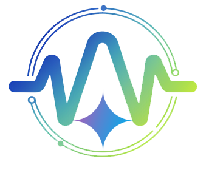 Ariel User Manual

Ariel is an AI-powered video dubbing tool designed to translate video voice
tracks seamlessly. It utilizes Google's Gemini models to transcribe, translate,
and re-dub videos into different languages while preserving background music and
sound effects. The tool provides a web-based interface for uploading videos,
managing speakers, editing translations, and fine-tuning audio timing.

## Note on Data Residency

## Ariel uses Google Gemini Text-To-Speech (TTS). This model is only available using the global Cloud Region. To simplify deployment, as certain versions of Gemini models are not available in every region, we also use the global region when sending data to Gemini. If you have strict policies requiring you to process data in specific regions, please be aware that the solution will require bespoke changes to meet your requirements and cannot be used as is.

# Getting Started

To access Ariel v2.0, navigate to the URL provided by your deployment
administrator. The application runs in a web browser and does not require local
installation for the end-user.

## The Interface

Upon loading the application, you will be presented with the **Home**
screen. This is where you upload video and provide the initial processing parameters like Translation Language and which Gemini model you want to use. When you click to process video, Gemini will automatically detect original language and it will try to automatically select voices which are as close as possible to the voices in the video. All these settings can be changed later on Editor page.

--------------------------------------------------------------------------------

# 2\. Setting Up a Project

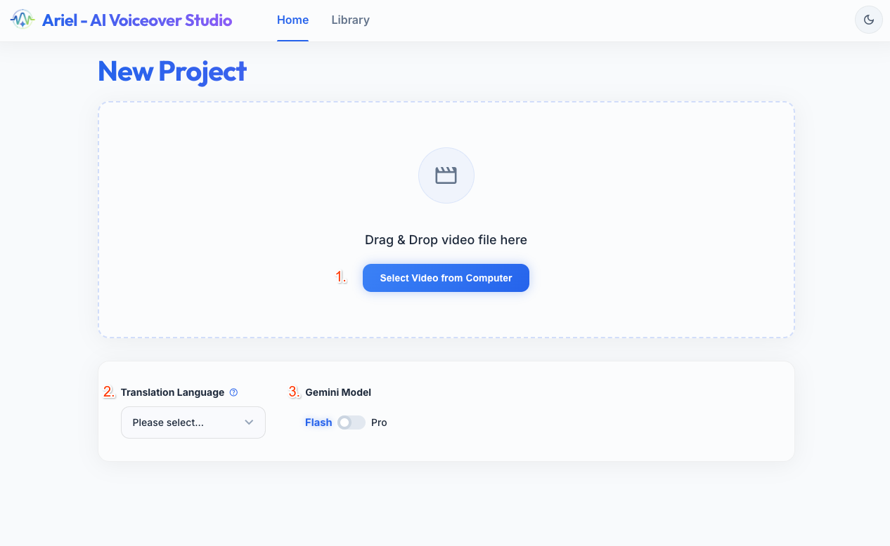

## Step 1: Upload Video

*  Drag and drop your video file (e.g., MP4) into the designated **Video Drop
    Zone** area.

*  Alternatively, click the **Select Video from Computer** button to browse
    your files.

*  Once selected, a preview of the video will appear in the player.

## Step 2: Select translation language

Select the target language you wish to dub the video into. You can use search bar inside the dropdown to find the language you want to use.

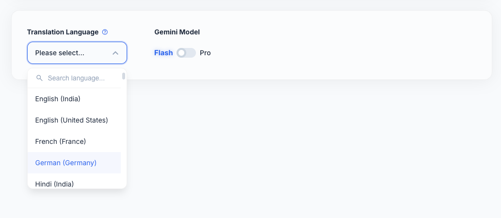

## Step 3: Select Gemini model

**Gemini Model Toggle:** Switch between **Flash** (faster, lower cost) and
**Pro** (higher quality, higher cost) models for the translation and logic
processing.

## Step 4: Start Processing

When you upload video and select translation language, the **Start Processing** button will appear. Click the button. The application will analyze the video and find the original language,separate the
audio tracks, transcribe the text, translate it, add speakers which are most similar to the original speakers and generate the initial
dubbing.

**Note:** The processing may take a few minutes depending on the video length and selected Gemini model.

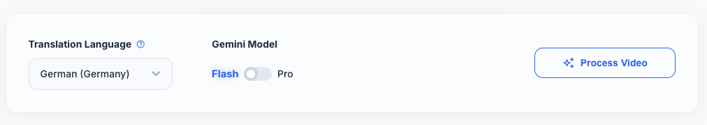

--------------------------------------------------------------------------------

# 3\. The Editor

Once processing is complete, the view shifts to the Editor page. Here you can
refine the translation, timing, and audio.

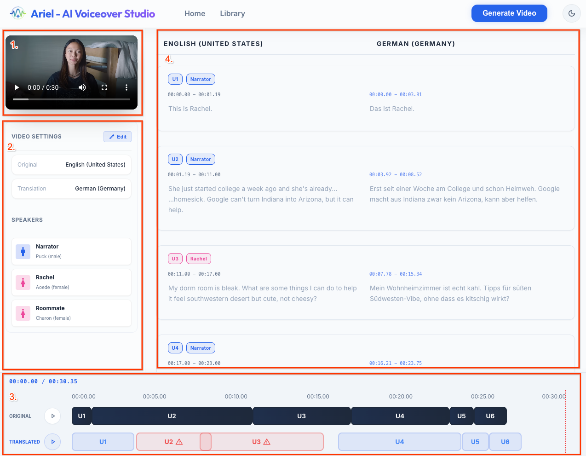

## 1 Video Player

A video player in upper left corner allows you to play the original video you uploaded.

## 2 Video Settings

The initial settings used for the dubbing are shown at the left side, below the original video.
If you need to change the target language or a list of speakers which Gemini selected:

1.  Click the **Edit** button in the **Video Settings** section (left side).

2.  Change the **Original Language** or **Translation Language** for the entire script.

3.  Click on **Add Speaker** to add a new speaker, or click on an existing speaker's name to change the voice for all their lines.

4.  Click **Submit** to process these changes or **Cancel** to continue with the
    current dubbing.

After clicking **Submit**, the video will be reprocessed, with updated
transcription, translation, and dubbing.

## 3 The Timeline

The timeline visualizes the synchronization between the original audio and the
new dubbing.

*   **Original:** Shows the timing of the original speech. Each speaker is given
    a swimlane, with their utterances depicted as bars with lengths showing the
    duration of the utterance. The utterance ID (e.g. U1) is shown on the bar. If you click on play button, you can listen to the original audio for whole video.

*   **Translated:** Shows the generated audio blocks. As with the original, each
    speaker is given a swimlane for their utterances. If you click on play button, you can listen to the translated audio for whole video.

In the timeline, utterances have three colors:

*   **Blue:** the utterance does not overlap with another utterance.

*   **Red-stripped**: the current utterance overlaps with another. Generally,
    this means the translated utterance is longer than the original. Utterance will be also marked red if they are exceeding the original length of the video.

*   **Yellow with dotted border:** when you click on a button to create new utterance, utterance will be marked yellow until you save it. When you save it, it will turn blue or red - depending on whether it overlaps with another utterance.

You can **drag a translated utterance** to adjust its start time. Click and drag
a translated utterance block left or right to change its start time manually.
The duration of the utterance does not change when dragging.

## 4 Utterance List

Located on the middle of the screen, above the timeline, there is a list of utterances, i.e. segments of
speech from the video. Each utterance shows the utterance ID (e.g. U1), speaker name, text from the original video and translated text. 

When you click on one of the utterances in the list, it will be highlighted in the timeline as well.

--------------------------------------------------------------------------------

# 5\. Editing Utterances

If you click on one of the utterances in the list, you will see different options for editing the utterance. 

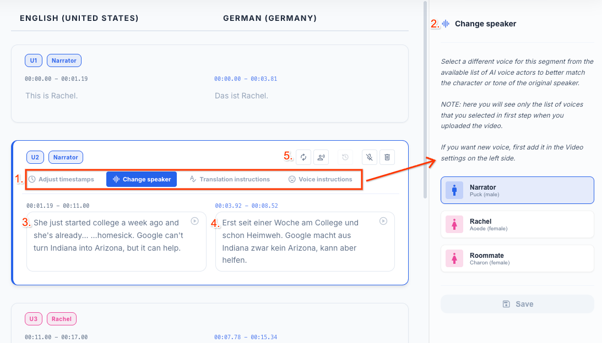

## Available Options:

1.  **Utterance instructions:** You will see 4 tabs here:
    *   **Adjust timestamps:** Fine-tune when the dubbed audio starts and ends to ensure it aligns perfectly with the visuals and doesn't overlap with other speakers.  You can do this also by dragging the utterance in the timeline. 
    *   **Change Speaker:** By default, Gemini will select the speaker for each utterance. But here you can change the speaker by selecting a different speaker from the dropdown menu. 
    *   **Translate instructions:** Provide specific guidance for Gemini (e.g., "translate more formally" or "keep technical terms in English") to improve the accuracy or tone of the rewritten script.
    *   **Voice Instructions:** Add voice instructions (e.g., "speak faster," "with a happy tone," or "emphasize the first word") to control how the AI delivers the dubbed audio.

    
2.  **Utterance instructions tab:** When you click on one of the tabs, the section will open on the right side, where you can adjust and save the settings for that specific tab.
    

3.  **Original Text:** This may be necessary for misunderstood slang or if you’d like to use a different specific text for the translation. If you want to hear audio for original text, click on the play icon inside the text box.

4. **Translated Text:** You can manually change the translation as well, by typing in the **Translated Text** box. You may want to do this to use more appropriate words for the context, or to change the length of the text to better match the original. After updating the translation, you should regenerate the dubbing, using the **Regenerate Dubbing** button. If you want to hear audio for translated text, click on the play icon inside the text box.

5.  **In addition, there are five icons placed in top right corner of each utterance card (from left to right):**

*  **Regenerate translate:** Used to regenerate the translation of the current utterance. If you add Translation instructions or if you change the original text, you should regenerate the translation. Button will be automatically highlighted if there are any changes in the original text or translation instructions.

*  **Regenerate dubbing:** Used to regenerate the dubbing of the current utterance. If you change the translated text or voice instructions, you should regenerate the dubbing. Button will be automatically highlighted if there are any changes in the translated text or voice instructions.

*  **Undo:** Used to undo the last change.

*  **Mute utterance:** Mute the utterance. Original audio will be played on that place. 
video.

*  **Remove utterance:** Remove the utterance. No audio will be played.

For example, if you add translation instructions, you will see the warning message "Translation & Dubbing changed", which means you need to regenerate translation and then dubbing to get your new translation instructions applied in the audio. Next to the message, you will see two highlighted buttons that you need to press in order to apply the changes. First you need to press the **Regenerate Translation** button, and then the **Regenerate Dubbing** button. If you then change the translated text or Voice instructions, you will see the same warning message, but this time only the **Regenerate Dubbing** button will be highlighted.

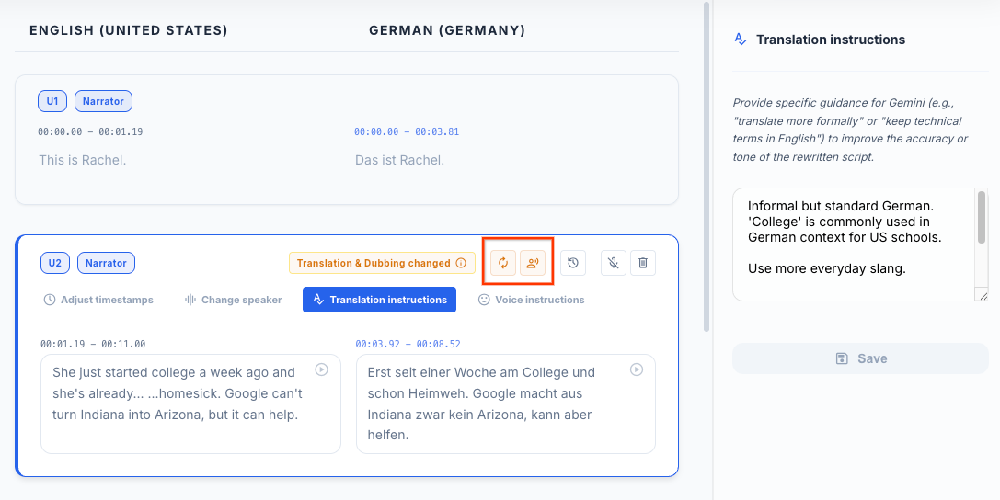 

## Merging existing utterances and adding new utterances

In case you want to merge existing utterances or add new ones, you can do it by clicking on one of these two buttons:

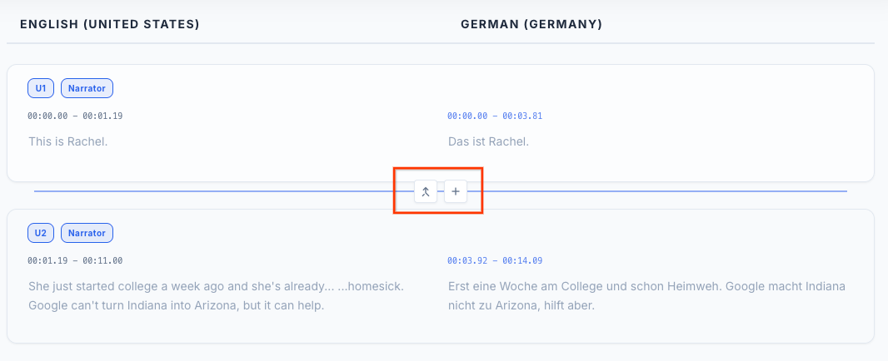 

The buttons will appear if you put mouse cursor between two utterances, or if you put mouse cursor at the beginning of the first utterance or at the end of the last utterance.

### Adding new utterances

When you are adding new utterance, you need to write text in original language and then click on the **Regenerate Translation** button to generate the translation text. After translation text appears, you can regenerate the dubbing by clicking on the **Regenerate Dubbing** button.

It is worth mentioning that utterances that you create by yourself won't be visible in the "Original" lane in the timeline, only in the "Translated" lane.

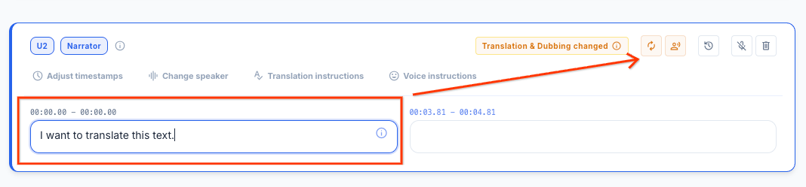 

### Merging existing utterances

If you click on merge button between two utterances, the text will be concatenated and you will see that the two utterances are merged into one. You need to regenerate the translation and dubbing to apply the changes.

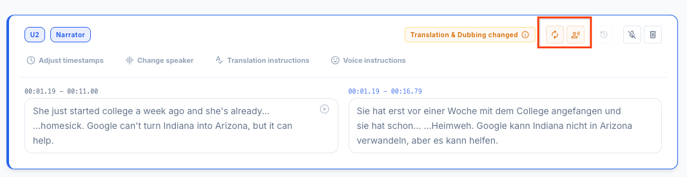 

# 6\. Finalizing and Downloading

Once you are satisfied with the edits click the blue **Generate Video** button
at the top right corner of the screen. The system will mix the background music, sound
effects, and new voice tracks into a final video file.

In case if you have some unsynced changes in the utterances, you will see a warning message popup, which means you need to regenerate translation and then dubbing to get your new translation instructions applied in the final audio.

When processing finishes, the result page will appear. On this page, you have the following options:

1.  **Preview:** Watch the final result in the player.

2.  **Video Actions:**

    *   **Download Video:** Saves the final MP4 file.

    *   **Download Final Audio:** Saves a WAV file containing the
        AI voices mixed with the background music. 

    *   **Download Vocals:** Saves a WAV file containing only the
        spoken AI voices.

    *   **Go back to editing:** Go back to the editing page to make changes to the utterances.

    *   **Start Over:** Go to the home page and start a new project.

        

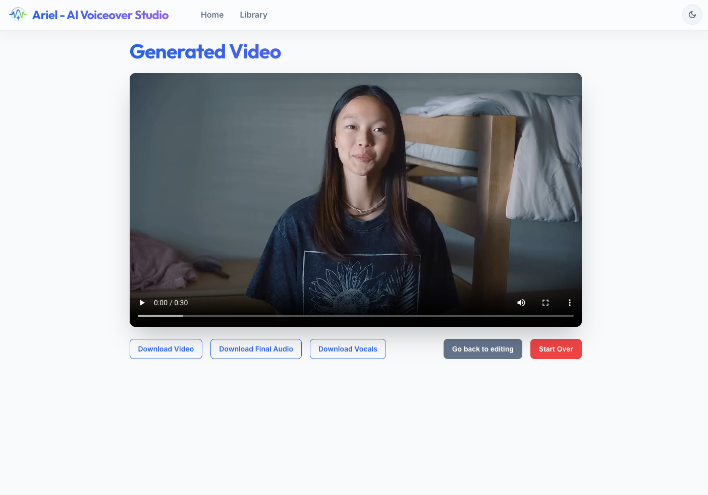

## Library page

All of your projects are saved in the library page. You can access the library page by clicking on the "Library" in the header. For each saved video you will see three options:

* **Download:** Watch the final MP4 file.

* **Edit:** Go back to the editing page to make changes to the video.

* **Delete:** Delete the video from your GCS bucket.

**NOTE:** In case if you start editing the video on Editor page, you will see the project only on the Editor page until you close the browser tab (changes won't be saved). The video will be saved in Library page, only if you generate the video (click on the Generate Video button).

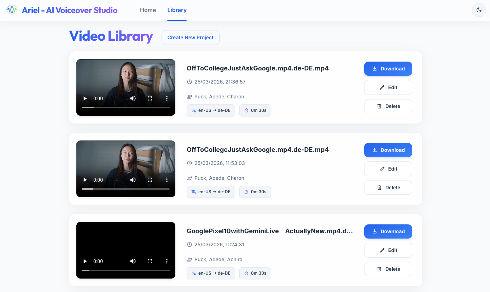

--------------------------------------------------------------------------------

# Troubleshooting & Constraints

*   **Zero Duration Error:** If an utterance has a duration of 0s, you cannot
    generate the final video. Ensure all segments have valid start and end
    times.

*   **Overlapping Audio:** If you drag a timeline block on top of another, an
    overlap warning will appear. Adjust the timing to ensure clear audio.

*   **Cost Management:** Be aware that processing long videos consumes more
    tokens. A 10-second video uses approx. 1000-1500 tokens for transcription
    and 600-1000 for translation. At the time of writing (December 2025), this
    is less than 0.10 USD.

*   **Background sound sometimes too loud:** Ariel does not currently support
    independent volume controls for separate audio tracks. To adjust the volume
    balance between the voice-over and background music please download the
    voice-over track via Download Vocals and use your external video
    editing software.

*   **Music Lyrics Removed by Ariel:** Ariel may mistakenly remove original
    vocals if your background music contains lyrics. To fix this, go to the
    Generated Video view, select Download Vocals, and manually replace
    the original voice-over track in your video editor.

--------------------------------------------------------------------------------

# Tips & Tricks

*   The “Adjust Speed” toggle (can be found when you click on utterance card and then on **Voice instructions** tab) can be used to provide a quick translation, but
    will rarely provide results suitable for use in an advertising campaign.

*   The gender of a narrator can be changed by selecting the same output
    language as the input language and selecting the appropriate voice.

*   You can speed up or slow down utterances by giving additional instructions
    to Gemini for the dubbing. Use words like “quickly” or “slowly” in Voice instructions tab.

--------------------------------------------------------------------------------

# Architecture

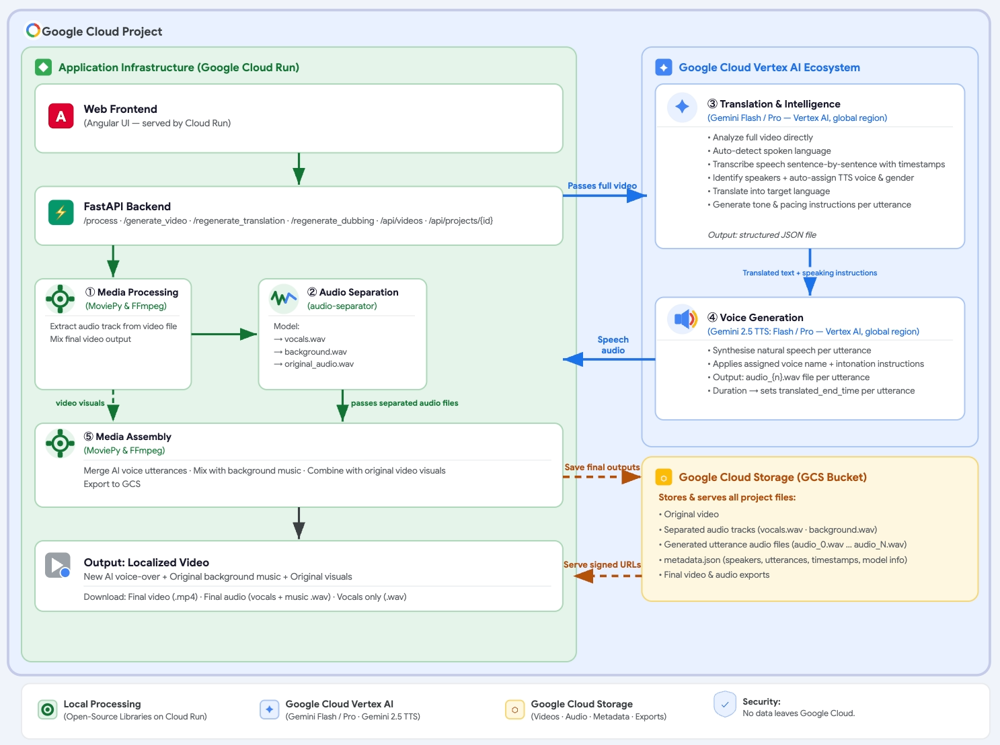

The solution is built entirely using **Google Cloud’s AI ecosystem**
(specifically Google Cloud Vertex AI) alongside open-source libraries for video reading, previewing and audio separation.

*   **No Third-Party SaaS (besides Google):** The solution does not send data to
    other third-party API / SaaS providers.
*   **Google Cloud Ecosystem:** The core generative AI components (Translation
    and Voice Generation) are exclusively Google Cloud services.
*   **Local Processing:** Audio Separation uses open-source library directly on the application infrastructure (Google
    Cloud Run), keeping that specific processing loop contained within the
    user's defined cloud environment.

Here is the detailed breakdown of the systems and models used:

## Audio Separation

It separates the vocal track from the background music/sound in the original
video so they can be processed independently.

## Transcription, Translation & Intelligence

The solution uses Google's Gemini models (configurable between Flash and Pro
variants). This is used to transcribe the original audio, translate the text and to annotate transcripts (identifying speakers, gender, and tone).

## Voice Generation (Text-to-Speech)

To generate natural-sounding speech, the solution utilises Google's
[Gemini 2.5 TTS](https://docs.cloud.google.com/text-to-speech/docs/gemini-tts)
models (Flash or Pro depending on user selection).

## Media Processing

[MoviePy](https://pypi.org/project/moviepy/) and
[FFmpeg](https://ffmpeg.org/about.html) libraries are used for manipulating
video files, extracting audio, and merging the new voice tracks with the
original background music. These are standard, very-popular open-source
libraries for multimedia processing (MIT/LGPL licenses).

## Other resources

Google Cloud's [Terms of Service](https://cloud.google.com/terms) and
[Service Specific Terms](https://cloud.google.com/terms/service-terms)
