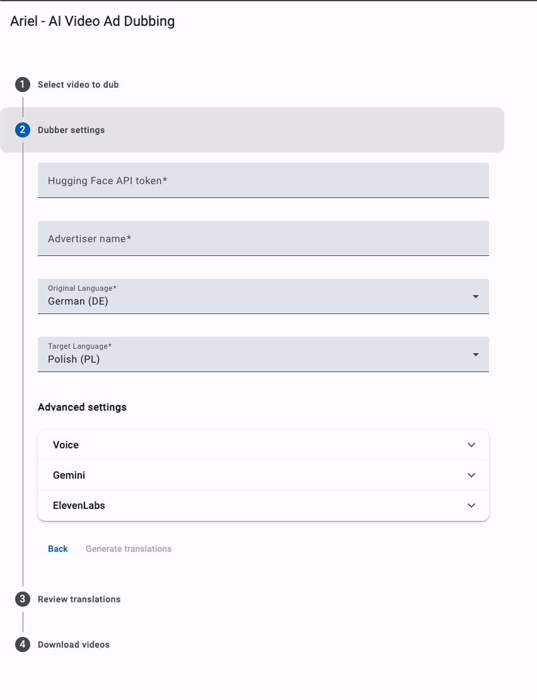

<!--
Copyright 2024 Google LLC

Licensed under the Apache License, Version 2.0 (the "License");
you may not use this file except in compliance with the License.
You may obtain a copy of the License at

      http://www.apache.org/licenses/LICENSE-2.0

Unless required by applicable law or agreed to in writing, software
distributed under the License is distributed on an "AS IS" BASIS,
WITHOUT WARRANTIES OR CONDITIONS OF ANY KIND, either express or implied.
See the License for the specific language governing permissions and
limitations under the License.
-->

# Ariel User Interface (UI)

Here, we provide a UI for Ariel.
The UI is an alternative to the provided Colab notebook. It enables you to
easily run video ad dubbing including full customization and editing of the
audio chunks.

## Updates

- November 2024: Initial release.

## Requirements

The Ariel UI is an [Angular](https://angular.dev/) based application that is contained within an Apps
Script project and performs dubbing with a dedicated Google Cloud backend. To get started, you need the following:

1.  **Google Cloud Platform Project** to host the backend. The following components
    are created during deployment:
    *   **Cloud Storage Bucket** to store input & output videos, video dubbing artifacts and
        all other metadata files. This bucket is also used as an interaction point with GUI
        (files created/removed there are triggering the backend processing).
    *   **Cloud Run** instance that processes all the steps. This part is implemented as a
        Python Docker container (which is also built during installation).
    *   **Pub/Sub Infrastructure** based on EventArc, it notifies the container of new files.
2.  **Cloud Run with GPU Support** is needed to ensure Ariel backend runs swiftly.
    You can apply for a Quota increase in a supported region using the [link here](https://cloud.google.com/run/docs/configuring/services/gpu#before-you-begin). This could take up to two days, however it is generally much quicker than that.
3.  **AppsScript Project** to host the frontend, an Angular web-app. For this,
    you need *Google Workspace* access.

### Deployment
Please make sure you have fulfilled all prerequisites mentioned under [Requirements](#Requirements) first.

1.  Make sure your system has an up-to-date installation of [Node.js and npm](https://docs.npmjs.com/downloading-and-installing-node-js-and-npm).
1.  Install [clasp](https://github.com/google/clasp) by running `npm install @google/clasp -g`, then login via `clasp login`.
1.  Navigate to the [Apps Script Settings page](https://script.google.com/home/usersettings) and `enable` the Apps Script API.
1.  Make sure your system has an up-to-date installation of the [gcloud CLI](https://cloud.google.com/sdk/docs/install), then login via `gcloud auth login`.
1.  Make sure your system has an up-to-date installation of `git` and use it to clone this repository:
    `git clone https://github.com/google-marketing-solutions/ariel`.
1.  Navigate to the directory where the source code lives: `cd ariel`.
1.  Run `npm start`. This will prompt you for configuration values and suggest reasonable defaults.

Our installation script handles everything else for you. It installs all the
required cloud and angular UI componenents, enables the required APIs and
outputs a link to the Ariel UI. Once you click on the link, you will be asked to
provide the relevant permissions.

That's it, you should have Ariel UI running in your browser now.
